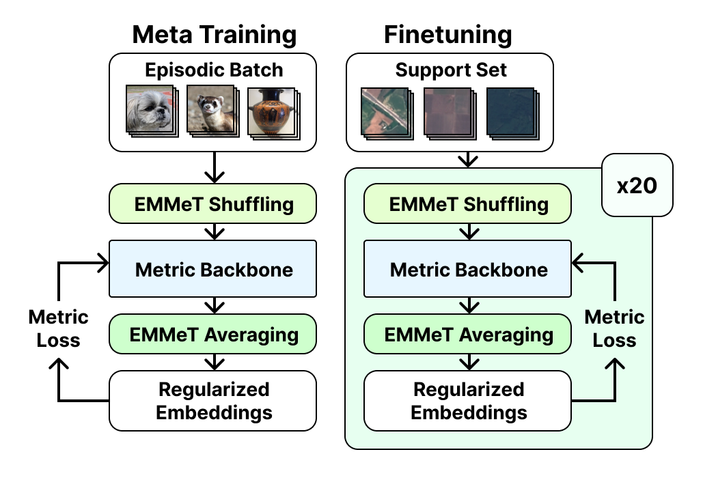
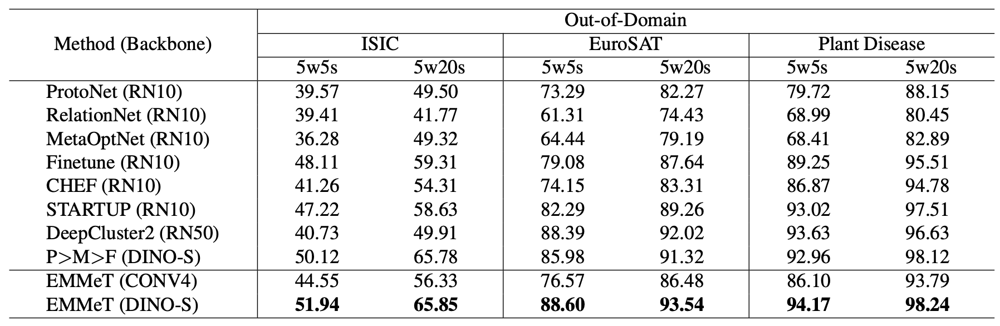
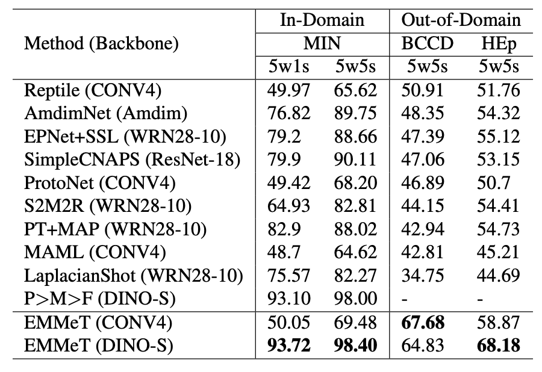

<h1 align="center">EMMeT</h1>

**E**mbedding **M**ixup for **Me**ta-**T**raining (EMMeT), a novel regularization technique that creates new episodic batches through an embedding shuffling and averaging regime.



## Experiments

Test EMMeT on a range of out-of-domain and in-domain datasets.

### Requirements

Install the requirements necessary for using EMMeT. A virtual environment (or similar) is recommended.

```bash
pip install -r requirements.txt
```

### Datasets

Datasets used in this work can be obtained at the following links:

- [mini-imagenet](https://github.com/yaoyao-liu/mini-imagenet-tools)
- [BCCD WBC](https://www.kaggle.com/datasets/brikwerk/bccd-white-blood-cell)
- [HEp-2](https://www.kaggle.com/datasets/brikwerk/hep2-human-epithelial-cell-images)
- [ISIC, EuroSAT, and Plant Disease](https://github.com/yunhuiguo/CVPR-2021-L2ID-Classification-Challenges#track-1-cross-domain-small-scale)

After downloading all datasets, you should extract/place each respective dataset's folder in the same directory.

### Pretrained Weights

You can download EMMeT-applied pretrained weights from [HuggingFace](https://huggingface.co/brikwerk/EMMeT/tree/main)

To use the pretrained weights, create a `models` folder at the root of this repo and place all pretrained weights in it.

### Running Experiments

Run the `test_finetune.py` and specify the number of shots, the finetuning iterations, image size, model type, model weights path, and the path to the root data directory (where you placed the downloaded datasets earlier). A 5-shot example run is shown below with a data root of `~/Data`:

```bash
python3 test_finetune.py --root_data_path "~/Data" --test_iters 20 --shots 5 --img_size 84 --model_type CONV4_VANILLA --model_path "./models/conv4.pth"
```

To see a full list of available options, run the following command to see the help dialogue:

```
python3 test_finetune.py --help
```

## In-Domain and Out-of-Domain Results



